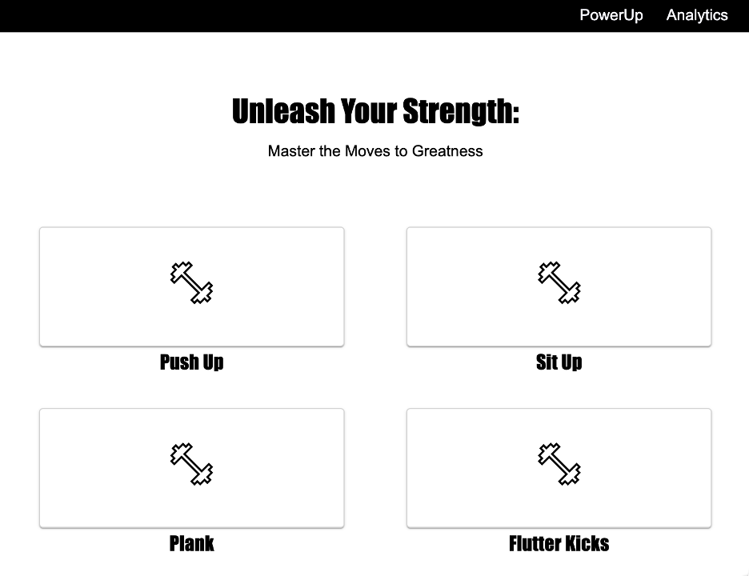

## PosePro AI pose module

This flask application is responsible for endpoints to provide interface for the AI pose estimator. 

## Dependency 

``` bash
pip install flask
pip install mediapipe
pip install opencv-python


```

## Demo



- Please check [this](https://drive.google.com/file/d/11dViNJ5ISMzobK3Esm_keUMLDvGkviSs/view?usp=share_link) out for a UI demo.# ProPro, an AI-powered fitness assistant


## To-dos

- convert vid to bvh
- convert bvh to animation 
- write the endpoint to sync frames
- write the endpoint to compare frames (body part specific)
- visually show the results on the animation 
- segment repetitive movements
- improve the counting algorithm
- using the comparison algorithm to score
- Procrustes analysis